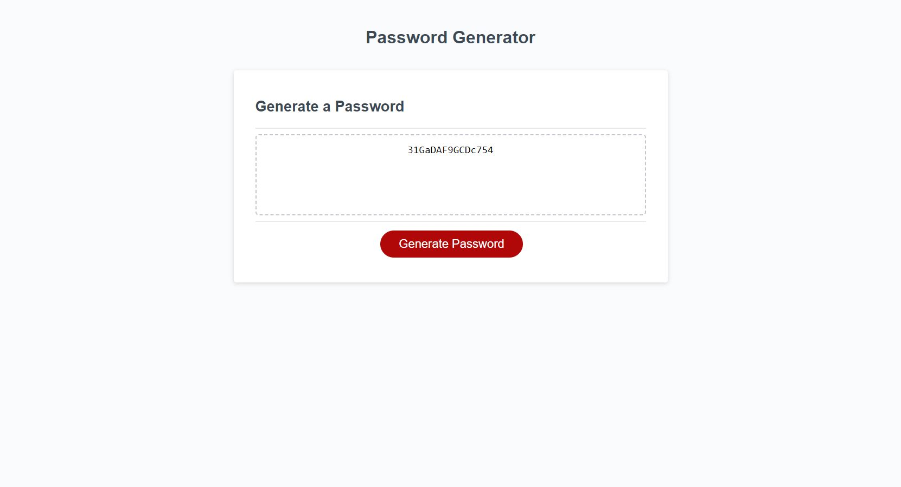

# 03 JavaScript: Password Generator

## Description

In this project I was tasked with creating a password generator that takes input from the user and outputs a password based on there given criteria.  I used JavaScript logic in order to acquire my desired result.  I found this particular project fun as I had to do much research on my own as well as think creatively.  To use this application, you first need to click on the generate password button.  After that a prompt will ask you for the length of your desired password.  Then there will be a series of confirm popups that ask for your different preferences about what is included in the password.  Finally a password matching the criteria selected will be outputted to the text box located in the middle of the page.

    

    

## Links

[Deployed Website](https://unheardof77.github.io/Password-Generator/)
[Github Repository](https://github.com/unheardof77/Password-Generator)

## License

None

